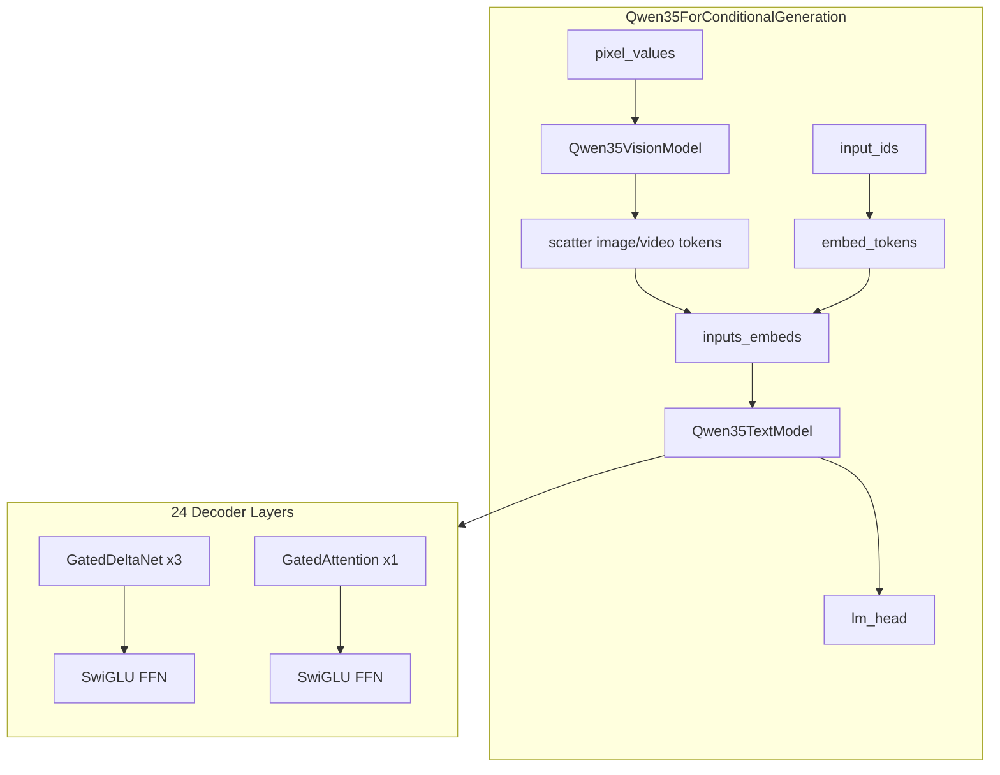

# Qwen3.5-0.8B 多模态复现（PyTorch + Transformers）

从零实现的 Qwen3.5-0.8B 学习型复现，包含：

- 文本主干：3:1 混合注意力（Gated DeltaNet + Gated Attention）
- 视觉编码器：Qwen3-VL 式 ViT
- 多模态封装：视觉 token scatter + mRoPE

## 架构概览



## 目录结构

| 路径 | 说明 |
|------|------|
| `src/qwen35/config.py` | 文本/视觉/顶层配置 |
| `src/qwen35/norm.py` | Offset RMSNorm、RMSNormGated |
| `src/qwen35/rope.py` | 交错 mRoPE + partial RoPE |
| `src/qwen35/attention.py` | Gated Attention（全注意力） |
| `src/qwen35/delta_net.py` | Gated DeltaNet（线性注意力） |
| `src/qwen35/cache.py` | HybridCache |
| `src/qwen35/layer.py` | DecoderLayer + MLP |
| `src/qwen35/model.py` | TextModel + ForCausalLM |
| `src/qwen35/vision.py` | VisionModel |
| `src/qwen35/multimodal.py` | ForConditionalGeneration |
| `src/qwen35/load_weights.py` | HF 权重映射与加载 |
| `scripts/download_config.py` | 仅下载 config/tokenizer/index |
| `scripts/dump_reference.py` | 生成 HF golden（需权重） |
| `scripts/compare.py` | 数值对齐（需权重） |
| `scripts/demo.py` | 推理 demo（需权重） |
| `scripts/verify_mapping.py` | 离线核对 HF key 映射（无需权重/torch） |

| `tests/smoke_test.py` | 无权重 smoke test（需 torch） |

## 快速开始

### 1. 下载小文件（不含权重）

```bash
python scripts/download_config.py --model-dir reference/model --out-dir reference
```

将下载 `config.json`、tokenizer、`model.safetensors.index.json` 等到 `reference/model/`，并生成 `reference/param_manifest.md`。

### 2. 离线核对权重 key 映射

```bash
python scripts/verify_mapping.py --manifest reference/param_manifest.md
```

### 3. 无权重 smoke test（需已安装 torch）

```bash
python tests/smoke_test.py
```

### 4. 手动下载权重后验证

将 `*.safetensors` 放入 `reference/model/`，然后：

```bash
# 生成 golden
python scripts/dump_reference.py --model-dir reference/model

# 数值对齐
python scripts/compare.py --model-dir reference/model --golden reference/golden_fp32.pt

# 推理 demo
python scripts/demo.py --model-dir reference/model --mode text --prompt "Hello, Qwen3.5!"
```

## 关键配置（Qwen3.5-0.8B）

- `hidden_size=1024`, `num_hidden_layers=24`, `intermediate_size=3584`
- `layer_types`: 每 4 层 1 个 `full_attention`，其余 `linear_attention`
- Gated Attention: 8 Q heads / 2 KV heads, `head_dim=256`, partial RoPE dim=64
- Gated DeltaNet: 16 QK heads / 16 V heads, `head_dim=128`, causal Conv1d kernel=4
- mRoPE: `mrope_section=[11,11,10]`, `rope_theta=1e7`
- 视觉: depth=12, hidden=768, patch=16, merge=2

## 说明

- 本复现跳过 MTP（多 token 预测）头。
- DeltaNet 使用纯 PyTorch 参考实现；可选安装 `causal-conv1d` / `fla-core` 加速（见 `requirements.txt` 注释）。
- 权重对齐需 transformers >= 4.57 且本地已有完整 safetensors。
